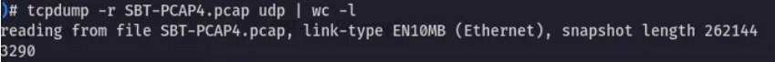
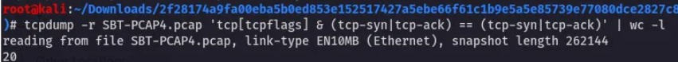
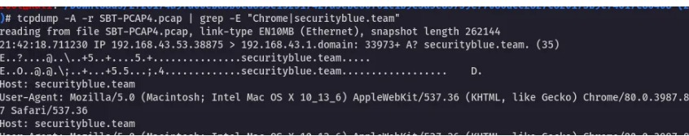
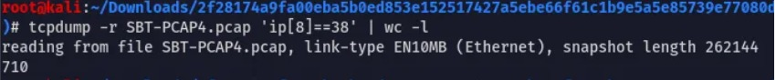
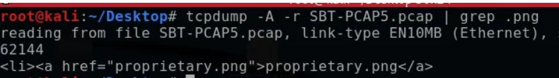
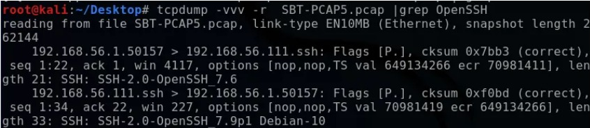
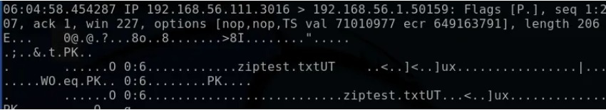
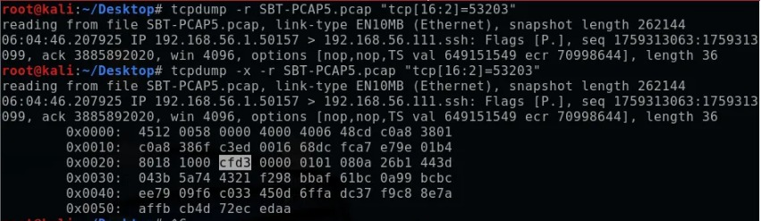

## Desafío TCPDump 🐾
[Actividad TCPDump – Introduction to TCPDump](https://elearning.securityblue.team/home/courses/free-courses/introduction-to-network-analysis#content#analysis-with-tcpdump#introduction-to-tcpdump#activity-tcpdump-challenge)

En esta actividad de **Análisis con TCPDump**, pondrás a prueba tus habilidades mediante el análisis de dos archivos PCAP:

---

### ⚠️ Descargo de responsabilidad

> Los archivos incluidos en “Análisis con TCPDump” son **propiedad** del equipo de Security Blue y se ofrecen **solo con fines educativos**.  
> 
> - **Alertas del navegador:** Chrome u otros navegadores pueden mostrar advertencias de seguridad por precaución.  
> - **Garantía de seguridad:** Estos PCAP han sido verificados y no contienen malware ni contenido dañino.  
> - **Recomendación:** Si lo deseas, utilízalos en una máquina virtual o entorno aislado.  
> - **Soporte:** Para dudas, escribe a `studentsupport@securityblue.team`.  

> **Nota:** No redistribuir sin permiso expreso del Equipo Azul de Seguridad.

---

## Instrucciones

1. Descarga los PCAP desde la sección “Actividad) Desafío TCPDump”.  
2. Usa filtros y flags de `tcpdump` para responder las preguntas.  
3. Documenta tus comandos, capturas de pantalla y hallazgos en tu informe.

---

## Preguntas de la actividad

### 🕵️‍♂️ **PCAP 4**

1. ¿Cuántos paquetes **UDP** se han capturado?  
2. ¿Cuántos paquetes **TCP** tienen los indicadores **SYN** y **ACK** simultáneamente?  
3. ¿Qué versión de **Chrome** se utilizó para conectarse a `securityblue.team`?  
4. ¿Cuántos paquetes muestran un **TTL** igual a `38`?

---

### 🕵️‍♀️ **PCAP 5**

1. ¿Cuál es el nombre del archivo **PNG** servido por el web server en `192.168.56.111`?  
2. ¿Qué versión de **OpenSSH** está ejecutando el servidor?  
3. ¿En qué **puerto** se descargó el archivo `.zip`?  
4. ¿A qué **hora** se capturó un paquete con **checksum TCP** `53203`?  
   > Formato: `HH:MM:SS.ffffff`

PCAP 4
How many UDP packets have been captured? 3290

---

How many TCP packets have both the SYN and ACK flags set? 20

---
Which version of Chrome was used to connect to securityblue.team? 80.0.3987.87

---
How many packets have a TTL value of 38? 710
 

---

PCAP 5
What is the name of the PNG file on the webserver at 192.168.56.111? porprietary.png

---
Which version of OpenSSH is running on the server? 7.9p1

---
On which port is the .zip file being served? 3016

---
When was a packet with a TCP checksum value of 53203 captured? (Format: xx:xx:xx.xxxxxx) 06:04;46.207925

---
